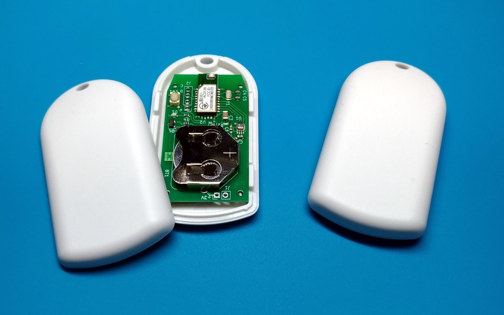
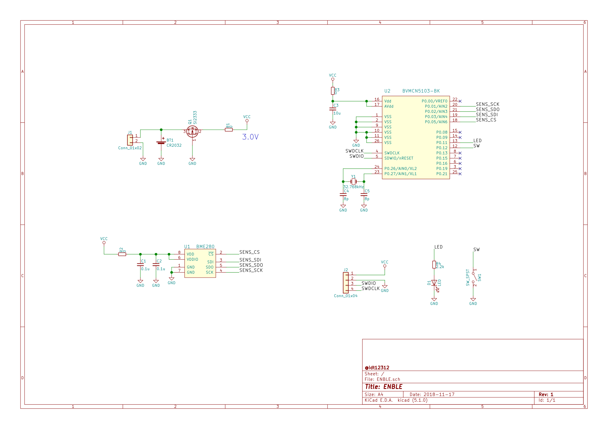
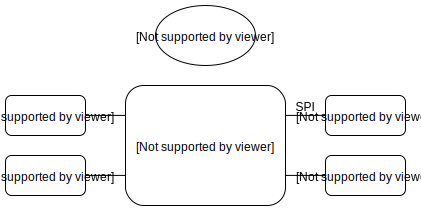
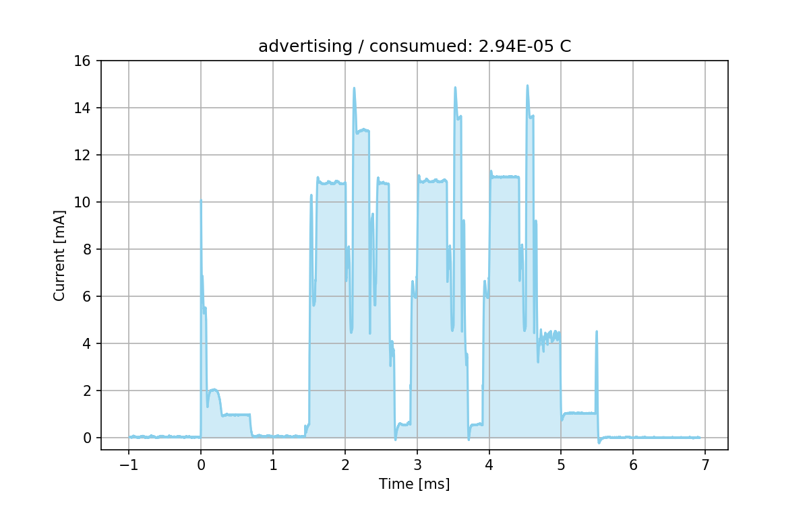
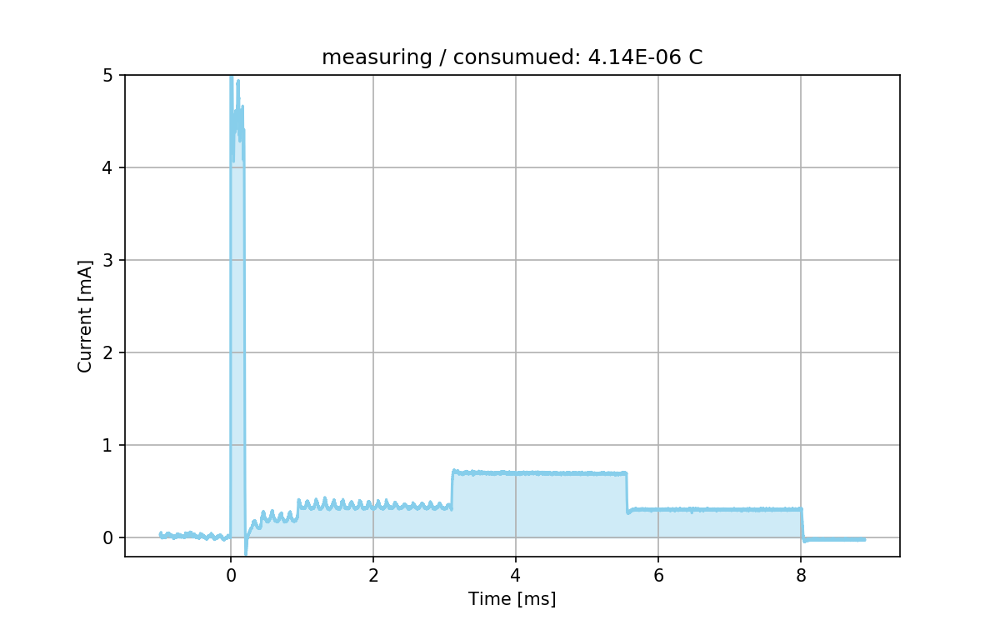

# ENBLE Sensor 



This device measures temperature, humidity and pressure using BME280 and send these measured data with BLE Advertising and BLE GATT.
The data format of BLE Advertising and BLE GATT is described bellow.
Using advertising (not using GATT) to collect measured data enables a device to reduce current consumption.  

## BLE Advertise

| Parameter          | Value                 |
|--------------------|-----------------------|
| Local Name         | "ENBLE"               |
| Advertise Interval | 6000ms                |
| Manufacturer data  | 10 bytes binary data  |

ENBLE has a push button.
If you push the button, advertising interval change into 100ms.
It is useful to find the specified device which you press the button. 

Manufacturer data has DeviceID and measurement results of sensors.  
Data format is as shown below. 

| Position | Contents    | DataType |
|----------|-------------|----------|
| byte 0-1 | DeviceID    | uint16   |
| byte 2-3 | Battery     | uint16   |
| byte 4-5 | Temperature | int16    |
| byte 6-7 | Humidity    | uint16   |
| byte 8-9 | Pressure    | uint16   |

Each data is contained in **little endian 16bit integer**.  
Means of above data are same as ones in bellow characteristics.


## BLE Services

| Name          | Type           | Permissions | UUID                                 | DataType |
|---------------|----------------|-------------|--------------------------------------|----------|
| ENBLE Service | Service        | Read        | bff20001-378e-4955-89d6-25948b941062 |          |
| DeviceID      | Characteristic | Read, Write | bff20011-378e-4955-89d6-25948b941062 | uint16   |
|  Period       | Characteristic | Read, Write | bff20012-378e-4955-89d6-25948b941062 | uint16   |
| Battery       | Characteristic | Read        | bff20021-378e-4955-89d6-25948b941062 | uint16   |
| Temperature   | Characteristic | Read        | bff20022-378e-4955-89d6-25948b941062 | int16    |
| Humidity      | Characteristic | Read        | bff20023-378e-4955-89d6-25948b941062 | uint16   |
| Pressure      | Characteristic | Read        | bff20024-378e-4955-89d6-25948b941062 | uint16   |


### DeviceID
This characteristic indicates a unique number as 16bit unsigned integer. 
The value of this characteristic is stored in nonvolatile memory. 

### Period
This characteristic indicates a sample period of sensors. 
All sensors (battery, temperature, humidity and pressure) sample at the same period. 
This period is 16 bit unsigned integer in seconds. 
The value of this characteristic is stored in nonvolatile memory. 

### Battery
This characteristic indicates battery voltage of the device in mV. 

### Temperature
This characteristic indicates temperature in degC, resolution is 0.01 DegC. 
A negative value is represented in two's complement number. 

### Humidity
This characteristic indicates humidity in %, resolution is 0.1 %.

### Pressure
This characteristic indicates air pressure in Pa, resolution is 10Pa


## Build

### Setup for build
1. Download Nordic SDK ver 12.3.0
2. Place Nordic SDK in firmware/lib  
ex) The structure of directory must be is following.   
    firmware/lib/  
        └──nRF5_SDK_12.3.0_d7731ad/ (this directory name can be anything you like)  
        .       ├──components/  
        .       ├──external/  
        .       ├── ......  

3. Modify NORDIC_SDK_PATH parameter in firmware/Makefile
4. Modify toolchain configuration in 
    * for Linux or OSX user : $(NORDIC_SDK_PATH)/components/toolchain/gcc/Makefile.posix
    * for Windows user : $(NORDIC_SDK_PATH)/components/toolchain/gcc/Makefile.windows

### Build and Flash firmware
This project can be build with GNU MAKE. 
What you need to do for build is executing ```make``` command. 
When you flah a firmware to an ENBLE sensor device, 
connect the device via JLink and execute ```make flash```.

## PCB

I design a PCB with KiCad. 



The following is a simple block diagram.



I designed PCB to fit in the case, [**TAKACHI PS-65 Seriese**](http://www.takachi-el.co.jp/data/pdf/2016-01-065.pdf). 

### Current consumption

| State       | Consumption | Interval   |
|-------------|-------------|------------|
| advertising | 29.4 μC     | 6.0 s      |
| measuring   | 4.14 μC     | 60 s       |
| sleeping    | 3.80 μA     | constantly |

<table border="0">
    <tr>
        <td></td>
        <td></td>
    </tr>
</table>


From the above per a hour current consumption is  
3600 / 6 * 29.4e-6 + 3600 / 60 * 4.14e-6 + 3600 * 3.8e-6 = 31.6 mC/h.

Since CR2032 battery charge is 810C(225mAh), 
ENBLE can work in
810 / 31.6e-3 = 25632h (**about 3 years**).

